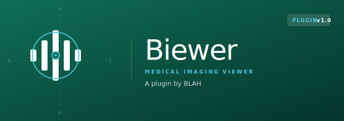

# @deepnoid/biewer



범용 영상 출력(viewer) 플러그인 for Deepnoid products.
프레임워크 무관 코어 + React / Web Component 어댑터로 어떤 FE 스택에서도 쓸 수 있다.

> **상태: M1 구현 진행 중.** 프레임워크 무관 코어 + React/Web Component 어댑터가 동작한다
> (이미지 포맷 · slice/auto 재생 · 도구 바인딩). 의료 볼륨/동영상/압축 디코더와 측정은 후속 마일스톤.
> 요구사항의 SSOT 는 [`docs/spec.md`](docs/spec.md), 진행 현황은 [`CHANGELOG.md`](CHANGELOG.md).

Biewer 는 **영상 출력만 담당하는** 플러그인이다.

- 플러그인이 소유: 포맷 해석(이미지 / 의료 볼륨 / 동영상 / 압축), 프레임 렌더링, 출력 모드(slice / auto), 뷰 단위 도구 프리미티브
- host 제품이 소유: 레이아웃 구성, 툴바 UI, 데이터 소스 정책, 인증, 라우팅, 상태 관리

뷰어 플러그인이 제품별 기능을 내부로 흡수하는 방향으로 자라는 것을 경계하고,
Biewer 는 **제품 기능이 플러그인으로 유입되지 않는 경계**를 처음부터 규칙으로 갖는다.
자세한 경계 정책은 [`docs/reference/architecture/boundary.md`](docs/reference/architecture/boundary.md).

---

## 지원 포맷 (계획)

| 분류 | 포맷 | 프레임 해석 |
|---|---|---|
| 이미지 | `webp` `jpeg` `png` `jpeg-ls` … (animated webp/gif 는 프레임화) | 1 frame (스택·애니메이션은 N frames) |
| 의료 볼륨 | `nii` `nii.gz` `dcm`(단일/시리즈, 코덱 풀 세트) | 선택 축(`native`/axial/coronal/sagittal) 기준 N frames |
| 동영상 | `mp4` … | 시간 축 샘플 N frames (step 설정) |
| 압축/컨테이너 | `zip` `gz` | 해제 후 내부 포맷으로 재해석 |

모든 입력은 **FrameSource**(N개의 프레임 시퀀스) 하나로 정규화되고, 뷰·도구·재생은 그 위에서만 동작한다.

## 출력 모드 (계획)

- **slice** — 스크롤/드래그/키로 프레임 인덱스 이동. 동영상은 사용자 설정 step(0.1s~N s) 단위로 seek.
- **auto** — play/pause/stop, 속도, loop, 구간 반복. 볼륨/스택도 cine 처럼 자동 이동.

## Install (계획)

**GitLab npm registry** 로 발행한다 (설계 결정 D1).

```bash
# .npmrc: @deepnoid:registry=https://gl.deepnoid.com/api/v4/projects/<id>/packages/npm/
npm install @deepnoid/biewer
npm install react react-dom     # peer — ^18 || ^19 지원 (D2)
```

## Quick start (설계안 — 구현과 함께 확정)

```tsx
import { BiewerView, useBiewerTools, useBiewerPlayback } from '@deepnoid/biewer';
import '@deepnoid/biewer/style.css';

function CompareGrid() {
  // 도구 컨트롤러 1개를 두 뷰에 바인딩 → 동시 적용(sync). scope 기본 'all'
  const tools = useBiewerTools();
  const playback = useBiewerPlayback({ mode: 'slice' });

  return (
    <div style={{ display: 'grid', gridTemplateColumns: '1fr 1fr', height: '100%' }}>
      <BiewerView source={{ kind: 'url', url: '/studies/a.nii.gz' }} tools={tools} playback={playback} />
      <BiewerView source={{ kind: 'url', url: '/studies/b.zip' }} tools={tools} playback={playback} />
    </div>
  );
}
```

레이아웃(grid, 1x1, 2x2, 자유 배치)은 전부 host 의 CSS/컴포넌트다. Biewer 는 단일 뷰만 제공한다.

## 프레임워크 호환

동작은 전부 vanilla TypeScript **코어**에 있고, 프레임워크별 어댑터는 얇은 층이다. 어느 진입점으로 써도 기능은 같다.
상세: [`docs/reference/architecture/framework-adapters.md`](docs/reference/architecture/framework-adapters.md).

| 진입점 | import | 대상 스택 |
|---|---|---|
| 코어 | `@deepnoid/biewer` | 프레임워크 없음 / 커스텀 통합 (`createBiewerView(el, opts)`) |
| React | `@deepnoid/biewer/react` | React 18/19 (`<BiewerView>`, `useBiewerTools` …) |
| Web Component | `@deepnoid/biewer/wc` | Vue · Angular · Svelte · 순수 HTML · 서버 템플릿 (`<biewer-view>`) |

```html
<!-- 어떤 프레임워크든: 표준 커스텀 엘리먼트 -->
<biewer-view id="v"></biewer-view>
<script type="module">
  import '@deepnoid/biewer/wc';
  document.getElementById('v').source = { kind: 'url', url: '/studies/a.nii.gz' };
</script>
```

## Biewer 가 제공하지 않는 것

호스트 제품 책임으로 남긴다:

- 인증(토큰 관리), 데이터 백엔드 계약(엔드포인트 설계)
- 레이아웃 엔진, viewType 프리셋, 툴바/버튼 UI
- 워크리스트/스터디 목록, 라우팅/URL 상태
- 3-plane 동시 MPR 뷰·VR(볼륨 렌더) — 단일 축 슬라이스 뷰(3축 선택)까지가 v0 범위
- SEG/AI 결과 오버레이 — 필요 시 overlay slot 으로 host 가 직접 그린다

## Docs

- [`docs/spec.md`](docs/spec.md) — **요구사항 SSOT** (정체성, 포맷, 출력 모드, 레이아웃, 도구)
- [`docs/usage.md`](docs/usage.md) — 컴포넌트/훅 API 초안
- [`docs/source-contract.md`](docs/source-contract.md) — host 가 데이터를 주입하는 계약
- [`docs/prd/`](docs/prd/index.md) — 기능별 PRD
- [`docs/reference/`](docs/reference/index.md) — architecture / types / skills

## Versioning

SemVer. `0.x` 는 설계·초기 구현 단계로 minor 간 breaking change 가능. [`CHANGELOG.md`](CHANGELOG.md) 참조.

## License

Proprietary — internal use at Deepnoid only.
